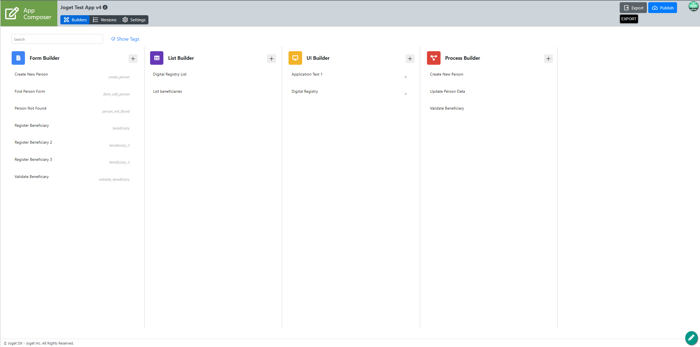
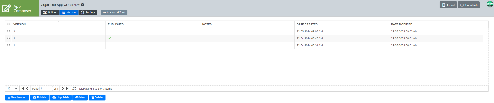
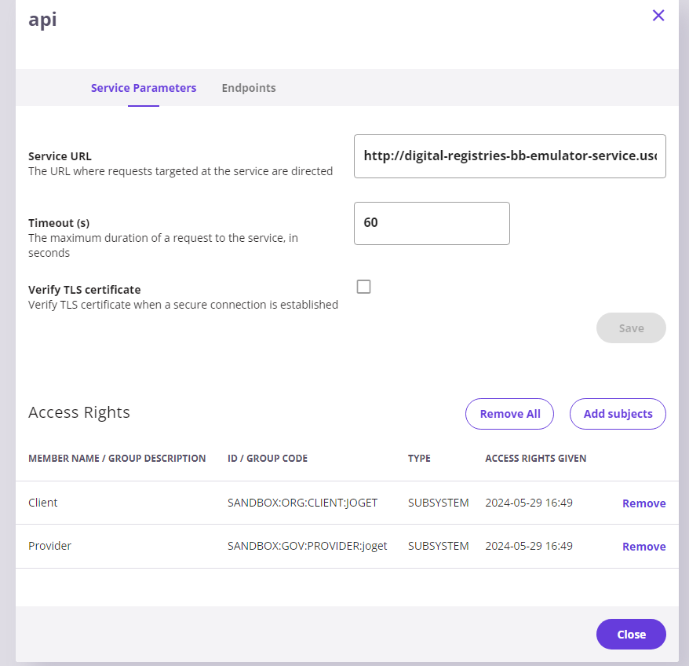
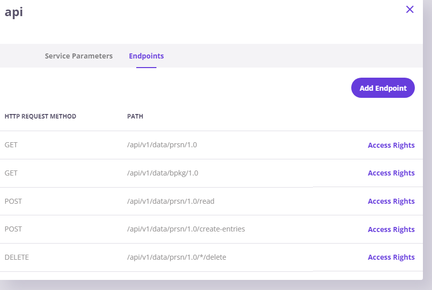
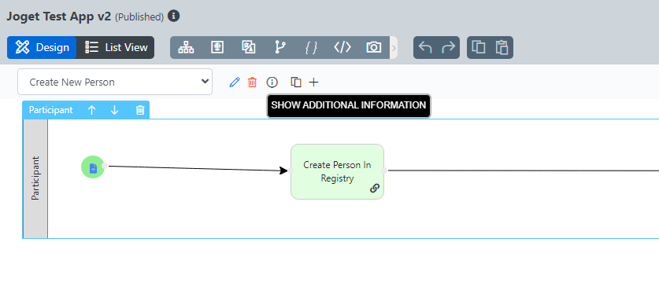
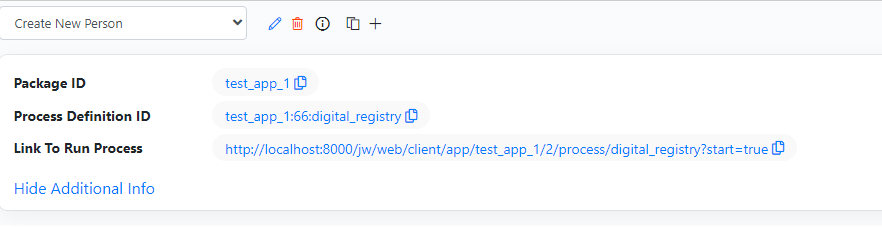
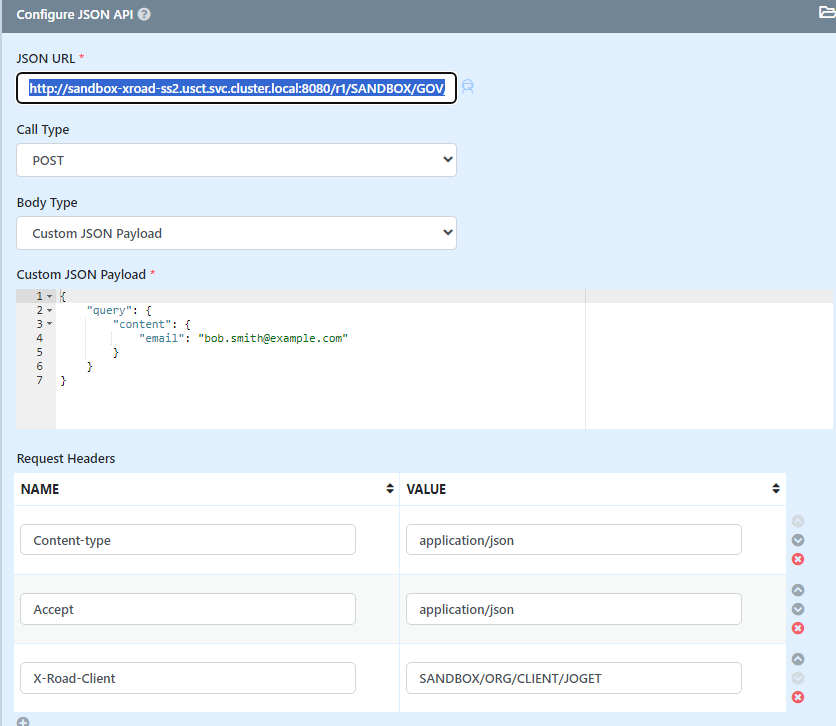
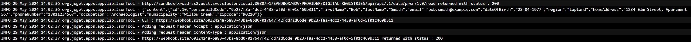

# Follow-up questions

## 1. Joget API Call Response
Joget Endpoint call responses are described together with the calls made to Joget in [here](#accessing-joget-endpoints-through-x-road).

## 2. UI Builder Demo

Building a UI is described in details in the previously created tutorial [Joget UI](./ui.md). It is a simple 'drag and drop' action and dropdown options selection of components needed in the specific UI.

UI modifications can be made as described in [Joget UI style modifications](./ui-mods.md).

## 3. Publishing different Joget App Versions

Publishing a new version of the Joget App can be made through the App Composer screen by clicking the **Versions** tab



Selecting a previously created version or creating a new one is made through the appropriate button.

If an already existing version is chosen the **Publish** button in the bottom left is clicked so that the version is published.

According to Joget's Documentation [Joget Updating Application Version Documentation](https://dev.joget.org/community/display/DX8/Version+Control#VersionControl-UpdatingApplicationVersion) and the Important Notes under Updating Application Version section **no more than one version at a time is allowed**:
```
Important Notes
- There can only be one published version at any point of time.
```

## 4. USCT X-road security server implementation and access

For using X-Road as an Information Mediator the setup steps are as follows:

1. Port forward UI of the Security Server 3 (using k9s interface or kubectl)
```
kubectl port-forward \
    -n usct \
    service/sandbox-xroad-ss3 4000 4000
```

2. Navigate to 'Clients' tab and press 'Add subsystem' button.

3. Fill 'joget' name as Subsystem Code.

4. Press Yes in Register client popup window.

5. Go into new 'joget' subsystem

6. Click on 'Services' tub.

7. Press 'Add REST' button.

8. Choose 'REST API Base Path' option

9. Fill 'http://joget-dx8-tomcat9.usct.svc.cluster.local:8080' into URL placeholder and '**joget**' into Service Code. First part (separated by the dots) of the URL specifies **the name of the joget service**, second - the **namespace the service** is in and the third part is **speciying it is a 'service'**.

10. Enable a new created service -> click on the related switch.

11. Expand a new created REST definition

12. Press 'Add subjects' in the 'Service Parameters' tab

13. Press 'Search' button

14. Check 'Client' and 'Provider' checkboxes and press 'Add selected'

15. Close popup

16. **(Optional)** If we want to access the endpoints from another security server we will have to port forward its management port and create a subsystem there.

    Let's say we want to connect through SS2:
    1. Port Forward **ss2:4000** to **4001**;
    2. Create a new **Subsystem** of **Client** with **Subsystem Code** - **JOGET**;
    3. Register the subsystem;
    4. Go into the subsystem -> **Internal Servers** tab -> set **Connection Type** to **HTTP**;
    5. Follow steps **11-14** to add the newly created **Subsystem**. Then add it's access rights in the subsystem and the endpoints. Later on, we will need to use this name as a value for the X-Road-Client header.

For the official DIY on registering services in X-Road visit [How to deploy USCT use case to minikube](https://github.com/GovStackWorkingGroup/sandbox-usecase-usct-backend/blob/main/docs/diy.md).

## Building Block Implementation through X-Road

For testing purposes the Digital Registries BB Emulator service is registered in X-Road following the steps from the [X-Road implementation section](#4-usct-x-road-security-server-implementation-and-access) using the appropriate Subsystem name (**DIGITAL-REGISTRIES**).

At step 8 the other option is selected - **OpenAPI 3 Description** and the address is

`http://digital-registries-bb-emulator-service.usct.svc.cluster.local:8080/v3/api-docs`

with service code being **api**.

After enabling the service via the switch we grant access to it for the Joget Client checking the **Client** checkboxes in **Access Rights** window.



All endpoints of Digital Registry BB Emulator will be automatically imported in the **Endpoints** tab:



Those endpoints can now be accessed through ss2's URL:

`http://localhost:8081/r1/SANDBOX/GOV/PROVIDER/DIGITAL-REGISTRIES/api/api/...`

or if used from inside the cluster:

`http://sandbox-xroad-ss2.usct.svc.cluster.local:8080/r1/SANDBOX/GOV/PROVIDER/DIGITAL-REGISTRIES/api/api/...`

## Accessing JOGET endpoints through X-Road

If we want to set up the joget app into X-Road we can follow the steps above but we will need to create custom endpoints after everything is set up properly. Possible ones are defined in [Joget DX8 Documentation](https://dev.joget.org/community/display/DX8/JSON+API).

**!!! IMPORTANT !!! Before sending any requests we need to set both API Domain and API IP Whitelists to " * " (Single Asterisk) for API calls in the System settings of Joget. Alternatively specific API Domains and API IPs can be whitelisted for API calls in the System settings of Joget.**

**Administration** Tab -> **Click to view more settings** (in the bottom of the page) -> **General settings** -> **API Domain Whitelist (Separated by ';')** being set to '*' and same for **IP Whitelist**.

## X-Road subsystem setup

 Following USCT's DIY after creating the client and subsystem of Joget we add a new REST (via **Add REST** button) -> **REST API Base Path**, URL set to `` http://joget-dx8-tomcat9.joget.svc.cluster.local:8080/`` and service code: ``joget``. Afterwards adding an endpoint is done similarly for all:
- Click on '>' before REST (``http://joget-dx8-tomcat9.joget...``)
- Click on joget
- Click on Endpoints
- Add Endpoint
- Choose HTTP Call Method (GET/POST)
- Insert URL of request in Path (e.g. `` jw/web/json/workflow/process/start/test_app_1:10:process4 ``)

## API Calls

If we want to use the endpoints from another security server we need to use its **http port** so we Port Forward its **8080** to let's say **8081** and do **Step 16** marked as optional [here](#4-usct-x-road-security-server-implementation-and-access). If we want to use the current ss3 then we do it for ss3's 8080 port.

After completion of the steps above the security server's endpoints can be accessed by using a url looking like:

``
http://localhost:8081/r1/SANDBOX/GOV/PROVIDER/joget/joget/jw/web/json/...
``

\+ adding a new header:

``
X-Road-Client: SANDBOX/ORG/CLIENT/TEST
``

or however the other security server's subsystem was set (If such was set) in step 16 marked as optional [here](#4-usct-x-road-security-server-implementation-and-access) replacing the **":" (colon)** in the subsystem ID with **"/" (slash)** symbols (e.g. `SANDBOX:ORG:CLIENT:JOGET` gets `SANDBOX/ORG/CLIENT/JOGET`)

and setting **Authorization** to **Basic Auth** with
``username: admin`` and ``password: admin``. These two are configured in Joget's General Settings under **Master Login Username** and **Master Login Password**.

**!!! The only place we are using '``localhost``' is when accessing a specific security server's (in our case security server 2) port forward where we are hitting the joget endpoints and it will be used such as ``localhost:8081``**.

After the addition of an endpoint through security server's configuration - port 4000 (in our case it's ss3) you should be able to access the endpoint through X-Road using a url similar to :
```
http://localhost:8081/r1/SANDBOX/GOV/PROVIDER/joget/joget/jw/web/json/...
```


### Starting a process
Starting a process is done through a **POST** request to

```
/jw/web/json/workflow/process/start/{processDefId}
```
e.g.
```
http://localhost:8081/r1/SANDBOX/GOV/PROVIDER/joget/joget/jw/web/json/workflow/process/start/test_app_1:2:digital_registry
```

using **Process Definition ID** of the workflow (after clicking the (i) button next to the delete button) here:


and replacing **processDefId** in the path with the specific one (in this case: **test_app_1:66:digital_registry**):


For triggering a process from an external page visit [Joget Documentation](https://dev.joget.org/community/display/DX7/Start+a+Process+from+External+Page).

An example of sending a request through JS Code can be found in a tutorial for [Starting a progress via JavaScript code](https://www.edgeverve.com/assistedge/knowledge-base/LCAP/Start-a-Process-from-External-Page_66815713.html).

If we want to set a value for a workflow variable when starting the process we add a **var_{variable_name}** parameter to the request url for every variable we want to set.

```
    /jw/web/json/workflow/process/start/{processId}?var_{variable_name}={variable_value}
```

where **processId** is replaced (e.g. **test_app_1:66:digital_registry**) and **variable_name** is replaced with the workflow variable's name and **variable_value** to the value we want to set.

[Documentation for setting workflow variables on process start](https://dev.joget.org/community/display/DX8/JSON+API#JSONAPI-web/json/workflow/process/start/(*:processDefId))

Sample response:
```
    {
        "recordId": "51abfe0b-2154-4378-b3cf-e4fc9fc1ccc3",
        "activityId": "",
        "processId": "1_test_app_1_digital_registry"
    }
```

### Getting info about a process instance
Getting different properties of a process instance is acquired through a `` GET / POST `` Request to URL:
```
    web/json/monitoring/process/view/(*:processId)
```
Sample Result:
```
    {
        "requester": "admin",
        "serviceLevelMonitor": "-",
        "processId": "224_crm_process1",
        "name": "Proposal Approval Process",
        "finishTime": "",
        "states": ["open.running", "open.running"],
        "packageId": "crm",
        "processDefId": "crm#3#process1",
        "dueDate": "",
        "startedTime": "",
        "version": "3"
    }
```

So far we are not aware of getting variable or process end status (or variable if one is set in the last step of the process) in any way other than calling the specific endpoint for the variable or setting a callback in js format where the call is made.

### Listing all workflow variables

**GET** or **POST** request to

```
    /jw/web/json/workflow/variable/list/{processId}
```

where **processId** again is replaced by the process definition ID (e.g. **test_app_1:66:digital_registry**).

Sample result:
```
    {
        "processId": "1_test_app_1_digital_registry",
        "variable": {
            "status": "approved"
        }
    }
```

## Replacing Digital Registries with X-Road Endpoint in a process

Using **Process 4** as an example -
1. Set **ss2**'s endpoint for the search -

    `http://sandbox-xroad-ss2.usct.svc.cluster.local:8080/r1/SANDBOX/GOV/PROVIDER/DIGITAL-REGISTRIES/api/api/v1/data/prsn/1.0/read`

2. Add the client header:

    ``
    X-Road-Client: SANDBOX/ORG/CLIENT/TEST
    ``

(or it being ``SANDBOX/ORG/CLIENT/JOGET`` if that is already configured)



After doing these steps correctly the process should be going as it used to previously with the direct connection to Digital Registries BB Emulator following the steps from [API Calls](#api-calls).

