# Joget Process using GovStack Building Block

## Opening Joget Test App
If the App is not visible in the dashboard follow [View App Procedure](../docs/forms.md#opening-joget-test-app).

## Create And Edit Processes
Create a new **Process** through the Process Builder navigation item or through the **App Composer** screen.

Processes can include seven components with two of them being required for every process:
1. Participant
2. Activity
3. Tool
4. Route
5. Subflow
6. Start (Required)
7. End (Required)

### Create New Person Process
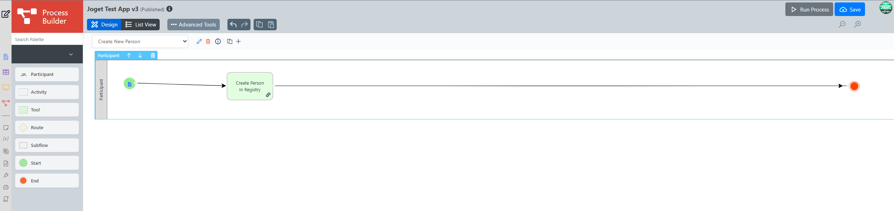

The **Create New Person** process has a tool only (along with starting and ending steps).

1. Start Point is configured to be the [Create New Person Form](./forms.md#create-new-person).
2. Second step in the process is a JSON API tool which makes a **POST** call to
```
http://digital-registries-bb-emulator-service.usct.svc.cluster.local:8080/api/v1/data/prsn/1.0/create-entries
```
with a **Custom JSON Payload** Body Type being (#form.FORM_NAME.FIELD_NAME# for different fields):
```
{
  "write": [
    {
      "content": {
        "personalIdCode": "#form.create_person2.firstName#",
        "firstName": "#form.create_person2.firstName#",
        "lastName": "#form.create_person2.lastName#",
        "email": "#form.create_person2.email#",
        "dateOfBirth": "#form.create_person2.dateOfBirth#",
        "region": "#form.create_person2.region#",
        "homeAddress": "#form.create_person2.homeAddress#",
        "phoneNumber": "#form.create_person2.phoneNumber#",
        "occupation": "#form.create_person2.occupation#",
        "municipality": "#form.create_person2.municipality#",
        "zipCode": "#form.create_person2.zipCode#"
      }
    }
  ]
}
```
and Request headers being:
```
Accept: application/json
Content-Type: application/json
```

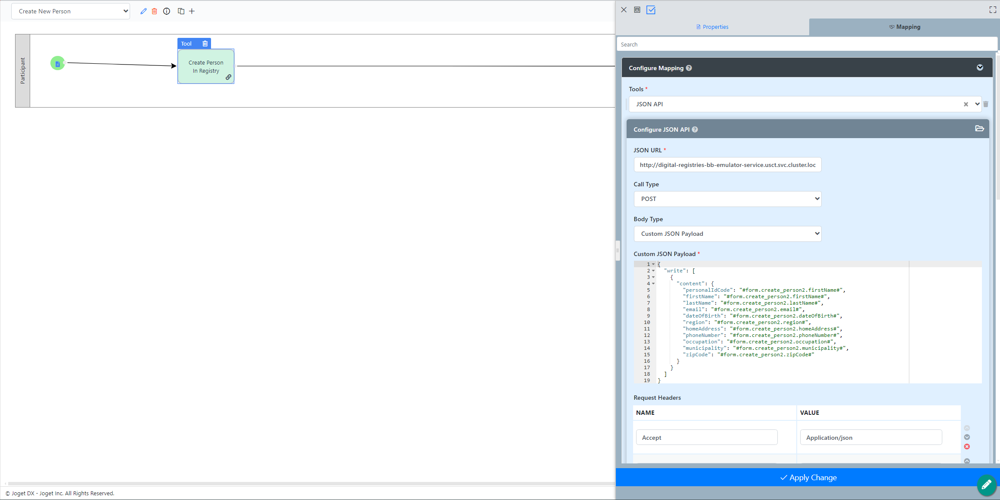

3. Process end

### Update Person Process
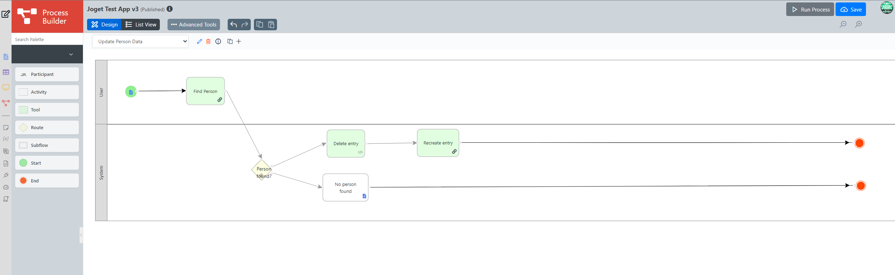

The **Update Person** process includes a tool, routing object, two consecutive tools in one case and an activity in the other case.

1. Start point is configured to be the the [Find Person Form](../docs/forms.md#update-person). The **Show The Next Assignment When Completed** checkbox should be checked.
2. The tool makes a **POST** call to
```
http://digital-registries-bb-emulator-service.usct.svc.cluster.local:8080/api/v1/data/prsn/1.0/read
```
 with a **Custom JSON Payload** being:
 ```
 {
    "query": {
        "content": {
            "email": "#form.form_edit_person.email#"
        }
    }
}
 ```
to decide if a person with the email entered in the form exists in Digital Registry's DB.
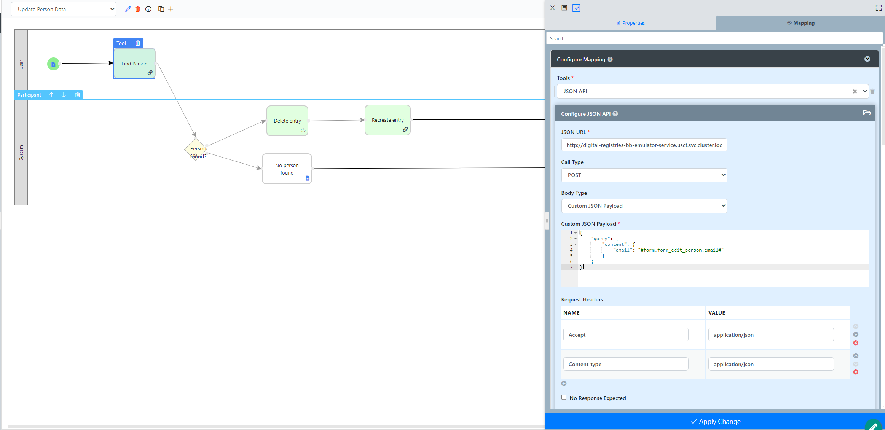

The tool is configured to save into different workflow variables the different elements of the JSON response.
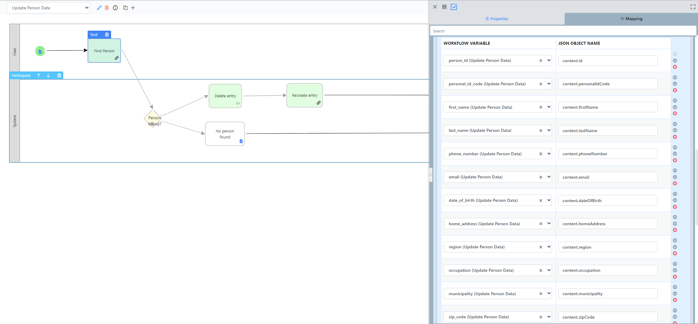

3. The routing object decides if the **person_id** variable is set and transitions to either **Delete entry** or **No Person Found** activity.

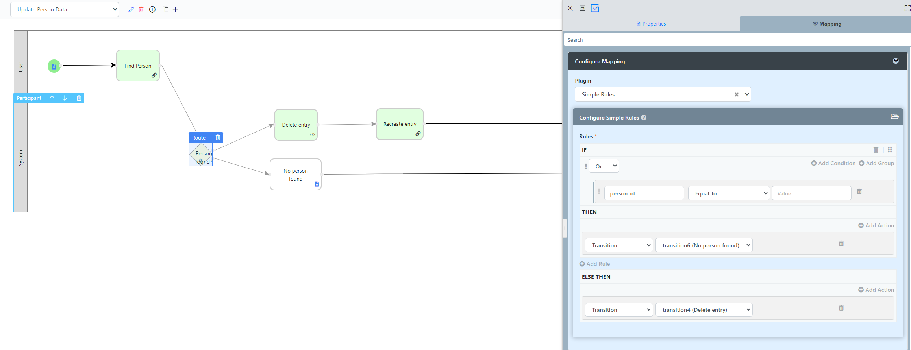

4.  1. Option 1: No person found - The No Person Found activty is triggered and the process ends.
    2. Option 2: Person Found -

        Beanshell code Tool is used to delete the entry from the emulator's db since the JSON API tool of Joget does not provide **DELETE** Call Type:
 ```
    import org.apache.http.HttpResponse;
    import org.apache.http.client.methods.HttpDelete;
    import org.apache.http.client.methods.HttpRequestBase;
    import org.apache.http.impl.client.CloseableHttpClient;
    import org.apache.http.impl.client.HttpClients;
    import java.io.IOException;
    import org.joget.commons.util.LogUtil;
    import java.io.*;

    CloseableHttpClient client = null;
    HttpRequestBase request = null;

    try{
        String jsonUrl = "http://digital-registries-bb-emulator-service.usct.svc.cluster.local:8080/api/v1/data/prsn/1.0/#variable.person_id#/delete"; //sample url3

        CloseableHttpClient client = HttpClients.createDefault();
        request = new HttpDelete(jsonUrl);
        request.setHeader("Accept", "Application/json");
        request.setHeader("Content-Type", "Application/json");

        HttpResponse response = client.execute(request);
        System.out.println("User #variable.person_id# updated successfully!\n New phone number: #form.form_edit_person.phoneNumber#");

    } catch (Exception ex) {
        LogUtil.error(getClass().getName(), ex, "");
    } finally {
        try {
            if (request != null) {
                request.releaseConnection();
            }
            if (client != null) {
                client.close();
            }
        } catch (IOException ex) {
            LogUtil.error(getClass().getName(), ex, "");
        }
    }
```

 Afterwards a Create New Entry tool makes a **POST** Call to
 ```
 http://digital-registries-bb-emulator-service.usct.svc.cluster.local:8080/api/v1/data/prsn/1.0/create-entries
 ```

 with a **Custom JSON Payload** being:
```
{
  "write": [
    {
      "content": {
        "personalIdCode": "#variable.personal_id_code#",
        "firstName": "#variable.first_name#",
        "lastName": "#variable.last_name#",
        "email": "#variable.email#",
        "dateOfBirth": "#variable.date_of_birth#",
        "region": "#variable.region#",
        "homeAddress": "#variable.home_address#",
        "phoneNumber": "#form.form_edit_person.phoneNumber#",
        "occupation": "#variable.occupation#",
        "municipality": "#variable.municipality#",
        "zipCode": "#variable.zip_code#"
      }
    }
  ]
}
```
and Request headers being:
```
Accept: application/json
Content-Type: application/json
```

5. Process end


### Validate Beneficiary Process
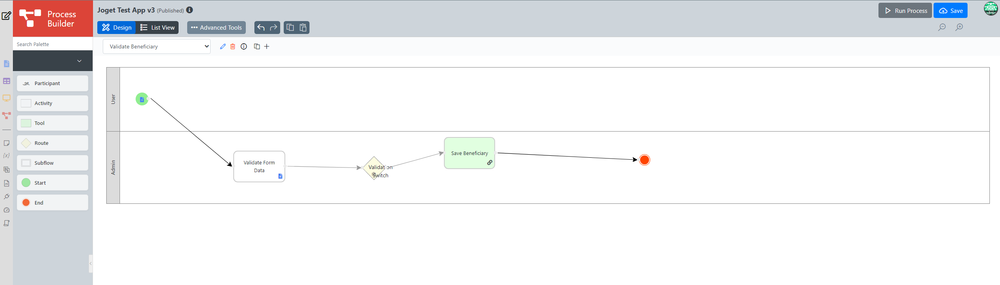

The **Validate Beneficiary** process includes an activity, a decision making route object and a tool.

1. Start point is the [Register Beneficiary Form](../docs/forms.md#register-beneficiary) configured by selecting Form and the corresponding form in the Mapping menu on the left.

2. The next step (Validating the beneficiary) is dragged into another participant's flow since the process is made by another user having Admin rights. Configure the mapping to **Validate Beneficiary Form**.

3. The routing object is set to redirect to the **Save Beneficiary** tool if the `status` variable is set to *valid*.
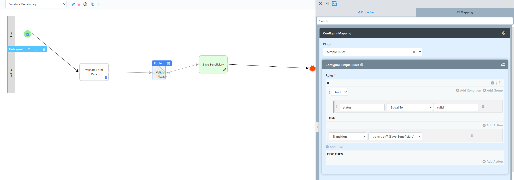

4. The Save beneficiary tool makes a **POST** API Call to the respective endpoint to save the data from the form using the `#form.beneficiary_2.id#` and other fields needed for the call (variables are included like`#variable_name#`).
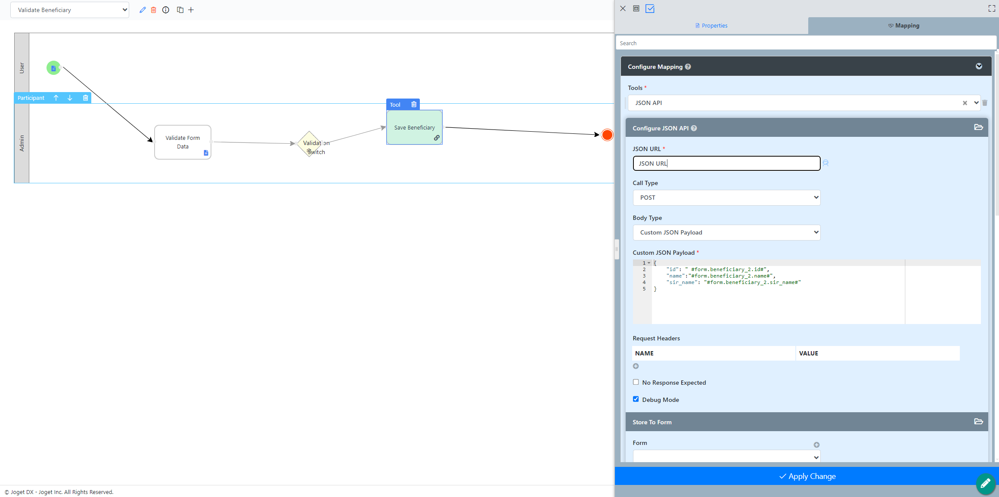

5. Process end

Processes can be previewed directly by clicking the **Run Process** button in the top right corner or through a [UI](../docs/ui.md).

### It is recommended to click **Apply Change** after every change made and click Save button in the top right corner to save the progress otherwise it may be lost!

## Joget Process Callback Option

Creating a process with two steps can be used as a callback function.

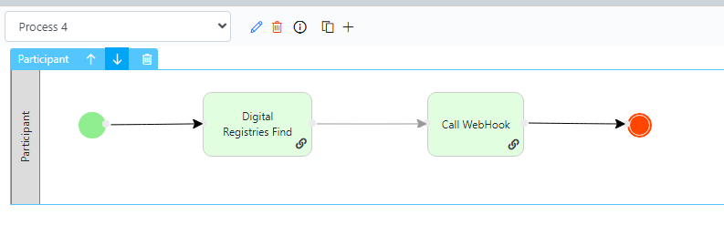

First step is connecting to the digital registry's BB Emulator for finding a person (*currently hardcoded as bob.smith@example.com*).

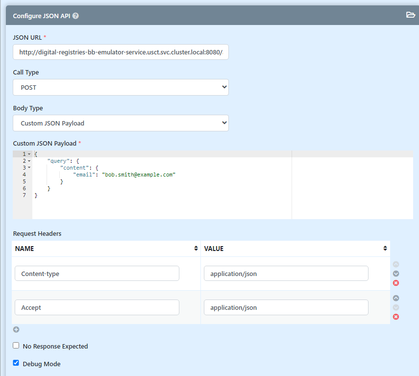

Taking the response for the existing person - specifically the **personalIdCode** from the **content** object and setting it to the workflow variable **cb**.

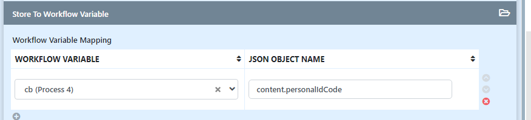

Later on, at the next step we use that workflow variable as a parameter (**idCode**) for the next call using the property assistant or entering **#variable.cd#**:

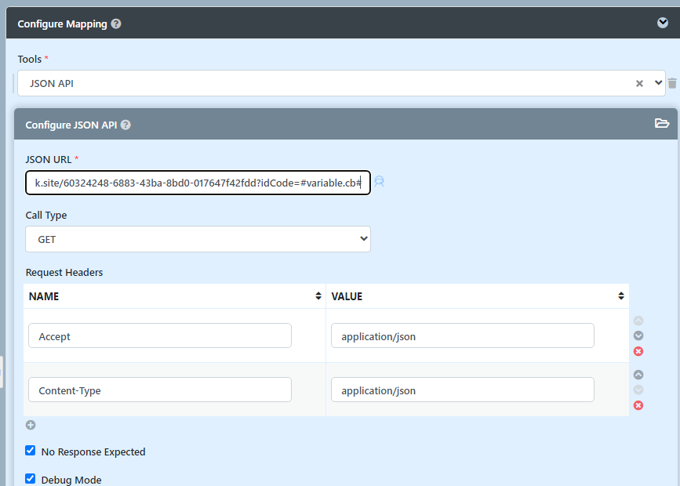

The JSON API call is configured for **No Response Expected** since we currently do not need it.

Log of the process and the API Requests and responses:

```
POST : http://digital-registries-bb-emulator-service.usct.svc.cluster.local:8080/api/v1/data/prsn/1.0/read

Custom JSON Payload : {__ "query": {__ "content": {__ "email": "bob.smith@example.com"__ }__ }__}
Adding request header Content-type : application/json
Adding request header Accept : application/json

http://digital-registries-bb-emulator-service.usct.svc.cluster.local:8080/api/v1/data/prsn/1.0/read returned with status : 200

{"content":{"id":10,"personalIdCode":"9b237f8a-4dc2-4438-af0d-5f01c469b311","firstName":"Bob","lastName":"Smith","email":"bob.smith@example.com","dateOfBirth":"28-04-1977","region":"Lapland","homeAddress":"1234 Elm Street, Apartment 567","phoneNumber":"18011234567","occupation":"Archaeologist","municipality":"Willow Creek","zipCode":"90210"}}


GET : https://webhook.site/60324248-6883-43ba-8bd0-017647f42fdd?idCode=9b237f8a-4dc2-4438-af0d-5f01c469b311

Adding request header Accept : application/json
Adding request header Content-Type : application/json

https://webhook.site/60324248-6883-43ba-8bd0-017647f42fdd?idCode=9b237f8a-4dc2-4438-af0d-5f01c469b311 returned with status : 200
```