# Joget UI style modifications

## Opening Joget Test App

If the App is not visible in the dashboard follow [View App Procedure](../docs/forms.md#opening-joget-test-app).

After opening the app choose the specific part of the application (**Form**, **List** or **UI**) whose styling you would like to modify.

## Predefined Styling options

Joget provides several different basic options to choose from when editing the style of the page.

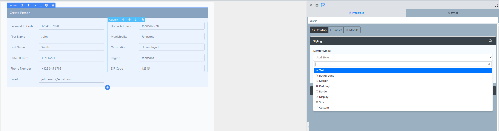

Each category consists of several other properties which can be set (listed in screenshots below):

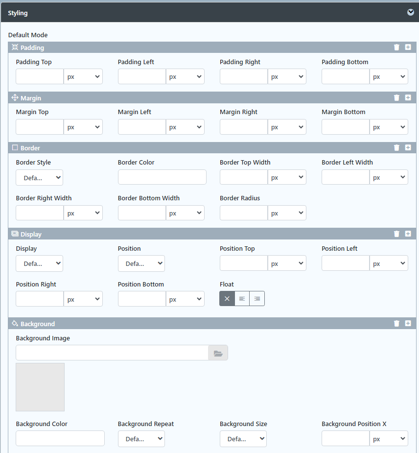

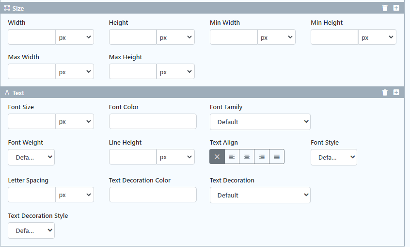

All of the configurations can be made specifically for the different platforms (Desktop, Tablet or Mobile) by selecting the platform above the styling options:

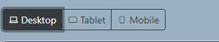

**ALMOST ALL** modifications can be made for the active/passive or hover mode of the element using the lower dropdown.

## Custom Styling

If we want to create a **custom styling** which is difficult to be recreated by the default menu options or we have a predefined css styling we want to use for the section we can use the custom styling tool which provides a text field for our CSS code.

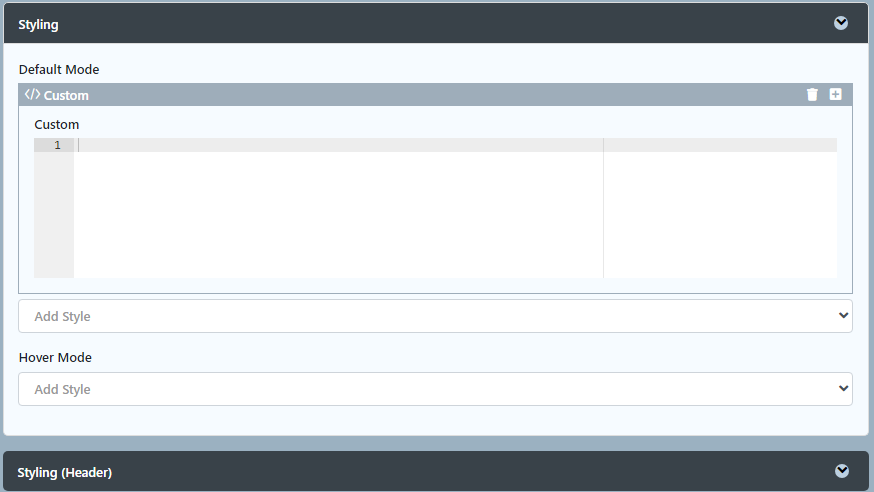

## Header

Styling the header happens through another place at the different section's styling that being a form or a list under the other styling option.

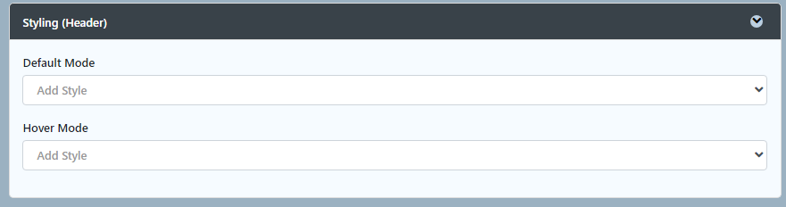

## UI Builder

Modifying the UI's styles happens through the options inside the ui builder. E.g. we can select a specific header color for the top bar.

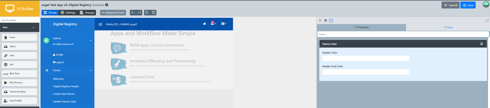
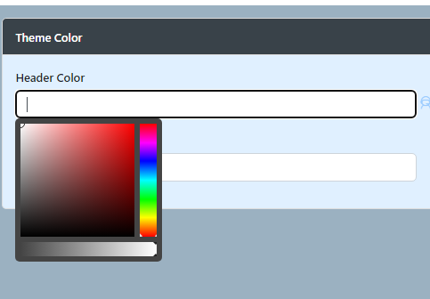

If we want to edit the styling of the content of the page we just create the look we want in the HTML editor directly.

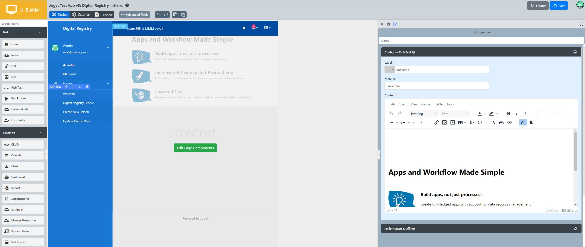

## Sidebar

Clicking on the left handside on the navigation bar (**Sidebar**) Joget provides styling options specifically created for navigation bars them being coloring options in different states (**Active** or **Not selected**).

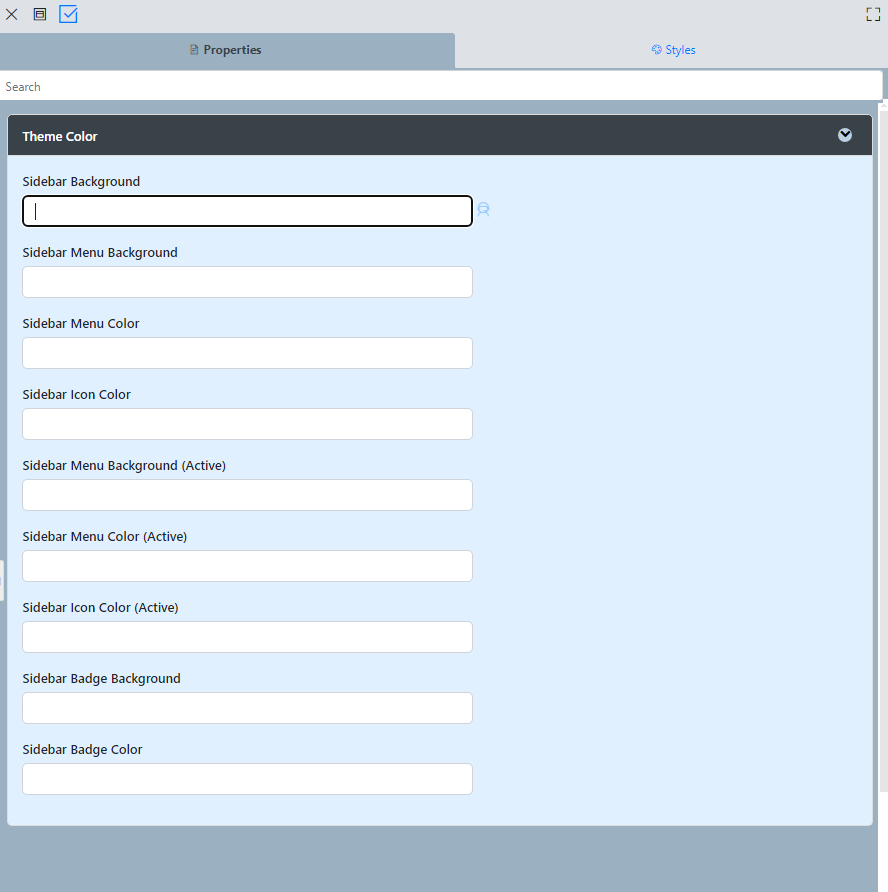

## Footer

Styling the footer is done by clicking the footer in the UI Builder and then modifying its predefined settings or modifying the styling just like all the other elements - through the **Styles** tab on the right.

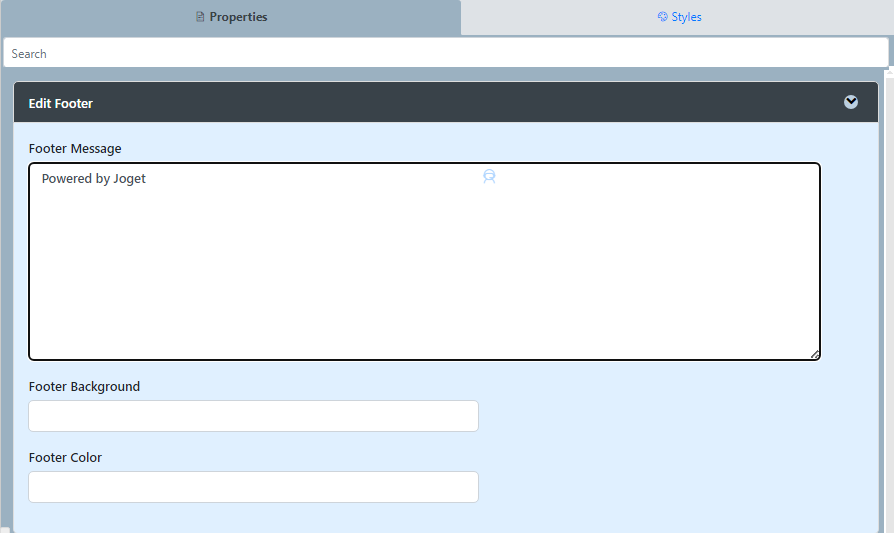

### It is recommended to click **Save** in the top right corner after every change made to save the progress otherwise some of it might be lost!